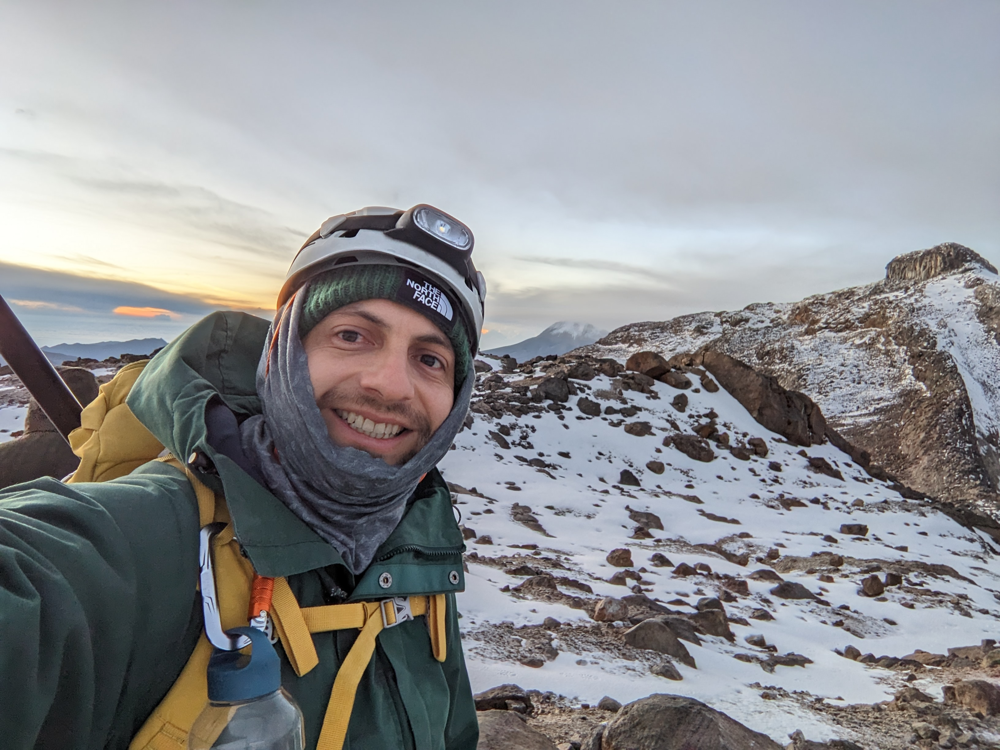

 

<figure>

<figcaption>Nevado Poleka Kasué, Parque de los nevados, Colombia. 2023
</figcaption>
</figure>

<h1>Últimas entradas</h1>

<ul>
  
  	
    <li>
      <h2><a href="{{ post.url }}">{{ post.title }}</a></h2>
      <!-- {{ post.excerpt }} -->
    </li>
    
  
</ul>
